# How IB-Tool 3 Works

This document explains the concept, processing pipeline, and algorithms behind IB-Tool 3.
The method is described in detail in:

> Harig, O.; Hecht, R.; Burghardt, D.; Meinel, G. **Automatic Delineation of Urban Growth Boundaries Based on Topographic Data Using Germany as a Case Study.** *ISPRS Int. J. Geo-Inf.* **2021**, *10*(5), 353. https://doi.org/10.3390/ijgi10050353

The parameterisation of the method and its grounding in § 34 BauGB are covered by
Harig (2024). For the relationship between the terms *Innenbereich* and *Urban
Growth Boundary* and for which publication covers which part of the method, see
[terminology.md](terminology.md).

---

## Concept

IB-Tool 3 delineates the **Innenbereich** (§ 34 BauGB) — the coherently built-up part of a municipality — from building footprint data. The international publication of the method (Harig et al. 2021) describes the same delineation as an *Urban Growth Boundary (UGB)*; see [terminology.md](terminology.md) for how the two terms relate. The goal is to replace manually drawn boundaries with an automated, reproducible, and homogeneous delineation that operates at a very fine-grained level: the boundary follows individual buildings rather than administrative units.

The core idea is morphological: buildings that form a continuous, dense development belong to the same settlement. The road network acts as a barrier — it divides the study area into blocks, and only blocks that are densely enough built up are included in the Innenbereich. Buildings within these blocks are then grouped by proximity using a Minimum Spanning Tree (MST), and the resulting groups are refined by snapping to road edges and closing gaps.

Because large topographic datasets can contain millions of objects, the study area is first divided into **partitions** that keep settlement bodies intact. Each partition is processed independently, and the results are merged at the end.

---

For input layer specifications, field requirements, filter file format, and the complete validation check table, see [docs/input-data.md](input-data.md).

---

## Processing Pipeline

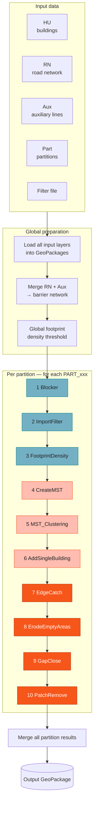

*Steps 1–3 prepare the data (blue), 4–6 aggregate buildings into rectangles (pink), 7–10 refine the settlement boundary (orange).*

```
Global preparation
│
├── Load all input layers into GeoPackages
├── Merge RN + Aux  →  combined barrier network
└── Calculate global footprint density threshold
         │
         ▼
Per-partition loop  (for each PART_xxx)
│
├──  1. Blocker          →  street blocks + city blocks from road/aux network
├──  2. ImportFilter     →  3-stage semantic + spatial + size filtering of buildings
├──  3. FootprintDensity →  calculate building coverage ratio; identify dense blocks
├──  4. CreateMST        →  Delaunay triangulation → MST, cut road-crossing edges
├──  5. MST_Clustering   →  MST-based aggregation into minimum bounding rectangles
├──  6. AddSingleBuilding →  bounding rect for large isolated buildings (> 300 m²)
├──  7. EdgeCatch        →  snap rectangles to road network
├──  8. ErodeEmptyAreas  →  remove building-free protrusions (voids ≥ 500 m²) at the fringe
├──  9. GapClose         →  close holes (> 1 ha removed) and gaps (≤ 70 m bridged)
└── 10. PatchRemove      →  remove splinter areas (< 1 ha, < 20 buildings)
         │
         ▼
Merge all partition results
         │
         ▼
Save to output GeoPackage
```

---

## Step-by-Step Explanation

### Global Preparation

**Load input layers**

All input layers (HU, RN, Part, Aux) are copied into temporary GeoPackages in the workspace folder and spatially indexed. This ensures consistent CRS handling and fast spatial queries throughout the run.

**Merge RN + Aux**

The auxiliary layer is merged with the road network into a single combined barrier layer. It must be provided as a line layer.

**Global footprint density threshold**

If no manual value is set, a global building coverage ratio is calculated from the entire dataset. This acts as a fallback for partitions where a local ratio cannot be determined (e.g. too few buildings). The procedure is identical to the local calculation described in Step 3.

---

### Per-Partition Loop

For each partition (e.g. `PART_36`), the following steps are executed:

---

### Step 1 — Blocker: Street and City Blocks

`Blocker.py` divides the partition into elementary spatial units using the road network and auxiliary data. Two types of blocks are distinguished:

- **Street blocks**: areas completely enclosed by roads/streets and the partition outline (Conzen 1960).
- **City blocks**: additionally include railway lines, forest edges, water bodies, and other topographical barriers as boundaries.

<p align="center">
  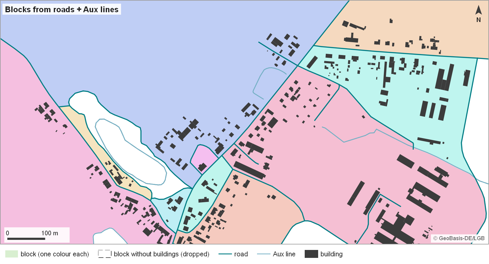
</p>

*Figure: Blocker on the sample data — roads and Aux lines cut the partition into blocks (here street and city blocks in one step, since RN and Aux are merged); blocks without buildings (white) are dropped. Data: © GeoBasis-DE/LGB.*

Sub-steps:

```
INPUT: road network (RN), auxiliary layer (Aux), partition polygon (Part)

1. Merge RN + Aux line geometries with Part outline  →  combined polyline layer
2. Polygonise combined polylines  →  candidate block polygons
3. Delete all polygons that contain no buildings
OUTPUT: block polygons (street blocks + city blocks)
```

Blocks at the edge of the settlement are typically very large (they transition into open space) and are treated separately in the density calculation.

---

### Step 2 — ImportFilter: Three-Stage Building Filter

`ImportFilter.py` removes buildings that are not relevant to Innenbereich delineation. According to BauGB § 35, certain building functions are permitted *outside* the Innenbereich (e.g. sewage treatment plants, wind turbines, livestock facilities, allotments). The filter applies three sequential stages:

<p align="center">
  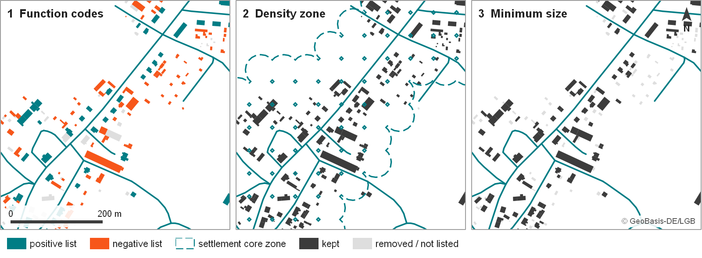
</p>

*Figure: ImportFilter in three stages — function codes (positive / negative list), the density-based settlement core zone (negative-list buildings outside it are removed), minimum size. Data: © GeoBasis-DE/LGB.*

#### Stage 1 — Negative filter (function code)

Buildings whose ATKIS function code appears in the negative filter list are marked for potential removal. These include:

- Agricultural/forestry buildings (barns, stables, sheds)
- Allotments and weekend cottages
- Technical infrastructure (sewage plants, power stations)

> Note: negative-filter buildings are *not* removed immediately — some of these functions also occur legitimately *within* settlements (e.g. barns in rural village centres). The next stage handles this.

#### Stage 2 — Spatial density filter

Buildings of the positive filter (residential, commercial, public buildings) define the settlement core:

```
INPUT: positive-filter building polygons

1. Convert positive-filter buildings to centroids
2. Calculate a kernel density raster of the centroids
     cell size = 50 m, search radius = 200 m
3. Convert raster cells to points; keep points with density value ≥ 4
     (threshold: isolated single buildings do not contribute)
4. Buffer the remaining points by 33.3 m (cell size / 1.5) and dissolve
     → nearly closed polygons around settlement cores
5. Remove negative-filter buildings that lie OUTSIDE these buffer polygons
OUTPUT: cleaned building layer (negative-filter buildings inside settlements retained)
```

#### Stage 3 — Minimum size filter

Small buildings and annexes not relevant for Innenbereich delineation are removed:

```
Groups of touching buildings: remove if total area ≤ min_area (default 56.8 m²)
Single buildings:             remove if area ≤ 35 m² (fixed)
```

These thresholds were determined empirically (Hecht 2014).

---

### Step 3 — FootprintDensity: Building Coverage Ratio

`FootprintDensity.py` calculates the **building coverage ratio (BCR)** — the ratio of the sum of building footprint areas to the reference area — and identifies which blocks are densely enough built up to be classified as fully within the Innenbereich.

<p align="center">
  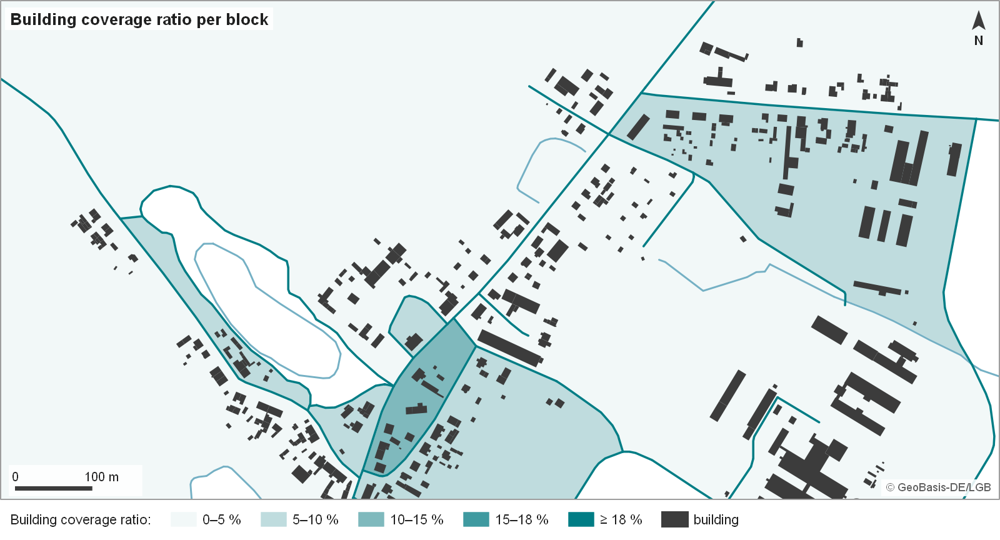
</p>

*Figure: Building coverage ratio per block. No block of the sample partition reaches the 18 % dense-block threshold, so none is classified as dense here. Data: © GeoBasis-DE/LGB.*

#### Local BCR threshold calculation

To avoid distortion by the large, sparse blocks at the settlement edge, only blocks near the settlement core are used as the reference:

```
INPUT: filtered buildings (HU_filter), street blocks

1. Buffer all buildings by 100 m
2. Dissolve overlapping buffers  →  settlement core polygons
3. Select blocks that lie COMPLETELY within a core polygon
4. Keep only blocks with ≥ 20 buildings or building sections
5. Calculate BCR per selected block:
     BCR = Σ(building_footprint_areas) / block_area
6. local_threshold = mean(BCR values of selected blocks)

FALLBACK: if no local threshold can be determined
          → use global_threshold (calculated from entire study area)
```

#### Dense block identification

```
FOR each city block:
    IF BCR(block) > 18%:
        classify as DENSE  →  directly assigned to Innenbereich
    ELSE:
        pass to MST aggregation (Steps 4–5)
```

The 18% threshold was derived empirically using expert delineations from Brandenburg: blocks meeting this criterion are inside the Innenbereich with 95% probability (Harig et al. 2021).

---

### Step 4 — CreateMST: Minimum Spanning Tree

`CreateMST.py` builds a graph over the filtered buildings and computes a Minimum Spanning Tree that represents the spatial backbone of the settlement.

<p align="center">
  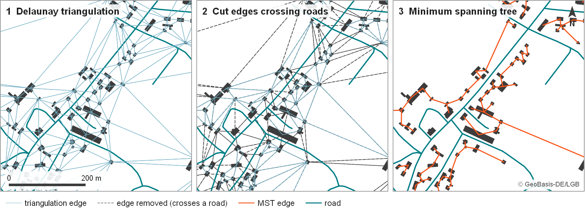
</p>

*Figure: CreateMST — Delaunay triangulation of the building centroids, edges crossing a road removed (grey), minimum spanning tree (orange). Data: © GeoBasis-DE/LGB.*

#### Sub-step 4a — Delaunay triangulation

```
INPUT: centroids of filtered buildings in non-dense blocks

1. Compute Delaunay triangulation on building centroids
2. Weight each edge by building-edge-to-building-edge distance
     (not centroid-to-centroid, to account for building size)
OUTPUT: weighted candidate graph
```

#### Sub-step 4b — Minimum Spanning Tree (Kruskal)

```
INPUT: weighted candidate graph

1. Apply Kruskal's algorithm (via networkx)
     → selects minimum-weight edges that connect all nodes without cycles
OUTPUT: MST
```

#### Sub-step 4c — Remove road-crossing edges

```
FOR each MST edge:
    IF edge crosses a road segment longer than 50 m:
        delete edge
OUTPUT: forest of smaller subtrees (one per settlement cluster candidate)
```

Road segments ≤ 50 m (dead ends, short access roads) are excluded from this check — only significant road barriers are used as cutting criteria.

---

### Step 5 — MST_Clustering: Aggregation into Minimum Bounding Rectangles

`MST_Clustering.py` groups the buildings along the MST subtrees into settlement polygons. The geometry type is an **edge-weighted Minimum Bounding Rectangle (MBR)** — oriented along the dominant building edges, not area-minimising — because the Innenbereich in Germany typically ends directly behind the last building and follows cadastral (predominantly rectangular) parcel shapes.

<p align="center">
  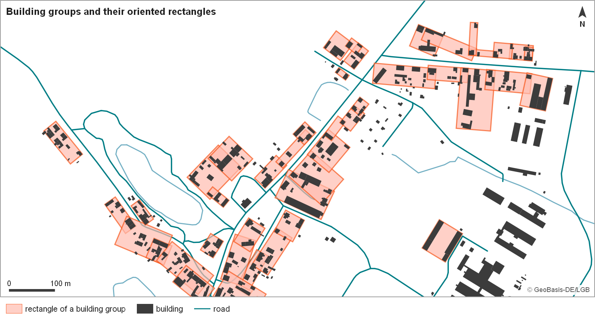
</p>

*Figure: MST_Clustering — building groups with their oriented rectangles on the sample data (Algorithms 1 and 2 below show how they are built). Data: © GeoBasis-DE/LGB.*

#### Algorithm 1 — Minimum Bounding Rectangle (MBR)

```
INPUT: list of building polygons (a group)

1. Extract all edges from building polygons
   (ignore edges shorter than 20 % of the building's longest edge —
    arc segments of round building parts)
2. Group edge directions that differ by less than 10°
3. Dominant orientation = direction of the group with the largest total edge length
4. Rotate coordinate system to dominant orientation
5. Compute axis-aligned bounding box in rotated system
6. Rotate bounding box back to original orientation
OUTPUT: oriented MBR polygon
```

<p align="center">
  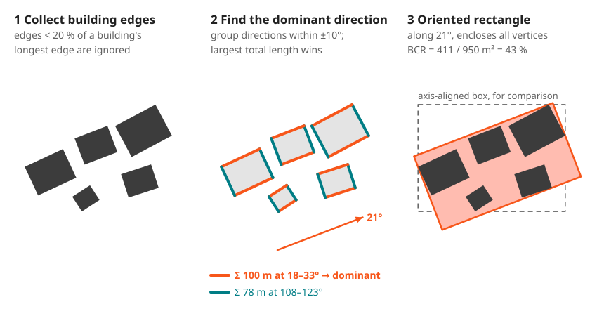
</p>

*Figure: Algorithm 1 — the rectangle follows the direction group with the largest total edge length, not the smallest possible area.*

#### Algorithm 2 — MST-based aggregation

```
INPUT: MST subtree (as sorted list of node pairs),
       local BCR threshold

1. Sort all MST edges by length (ascending)
2. Initialise: group_list = []

3. FOR each edge (node_a, node_b) in sorted list:

   a. IF node_a OR node_b already in a group G:
        temp_group = G + {node_a, node_b}
        mbr = MBR(temp_group)
        bcr = Σ(building_areas in temp_group) / area(mbr)
        IF bcr > local_threshold:
            update G with new members in group_list
        ELSE:
            keep G unchanged, then try the pair alone (step b)

   b. IF neither node is in a group, OR step a was rejected:
        new_group = {node_a, node_b}
        mbr = MBR(new_group)
        bcr = Σ(building_areas) / area(mbr)
        IF bcr > local_threshold:
            add new_group to group_list

4. FOR each group in group_list:
     output MBR(group)
OUTPUT: list of MBR polygons (one per building cluster)
```

The BCR check at each step ensures that only groups dense enough to form a coherent settlement unit are accepted. Adding a distant building that pushes the BCR below the threshold leaves the group unchanged.

<p align="center">
  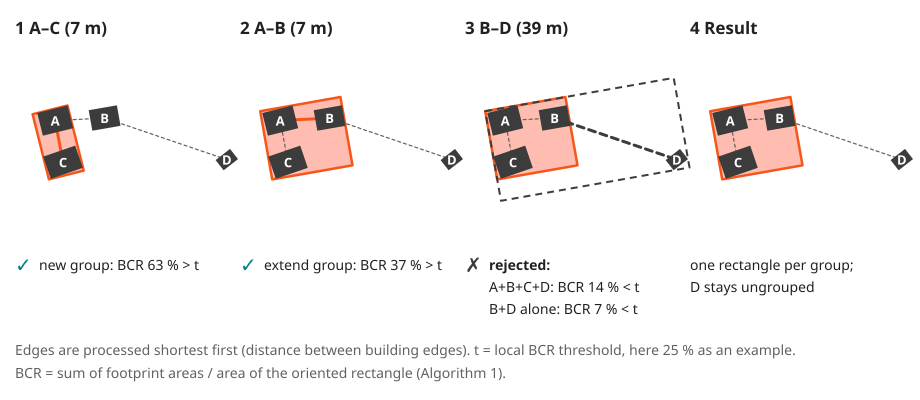
</p>

*Figure: Algorithm 2 — MST edges are processed shortest first; every extension must keep the group's BCR above the local threshold.*

---

### Step 6 — AddSingleBuilding: Isolated Large Buildings

`AddSingleBuilding.py` handles buildings that are relevant to the Innenbereich but were not captured by the MST aggregation — primarily large isolated buildings (footprint > 300 m²) outside existing cluster polygons (commercial buildings, public buildings, large agricultural buildings within the settlement).

```
INPUT: filtered buildings (HU_filter), MST cluster polygons

1. Calculate centroid (pointOnSurface) for each building
2. Select centroids that lie OUTSIDE any cluster polygon
3. Filter: keep only buildings with area > 300 m²  (or per min_area parameter)
4. FOR each selected building:
     compute MBR (same algorithm as Step 5, Algorithm 1)
OUTPUT: individual MBR polygons for isolated buildings
```

The result is merged with the cluster polygons from Step 5 before refinement.

---

### Step 7 — EdgeCatch: Snapping to Road Network

`EdgeCatch.py` snaps the MBR polygons to the neighbouring road network. Without this step, cluster boundaries may stop just inside or outside the road, creating thin slivers. The Innenbereich in Germany is generally defined as ending directly at or just behind the last building, often coinciding with the road edge.

<p align="center">
  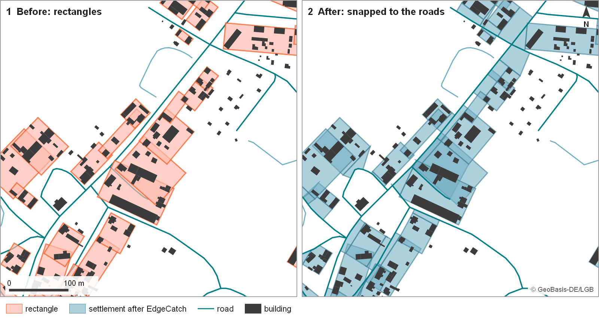
</p>

*Figure: EdgeCatch — rectangles before and after snapping to the road network (the schematic below shows how). Data: © GeoBasis-DE/LGB.*

#### Sub-step 7a — Pre-filter road segments

To avoid false snapping to distant roads:

```
1. Split road network into 20 m segments, assign stable seg_id
2. Buffer each segment by 25 m
3. Retain only segments whose buffer intersects a building footprint
OUTPUT: road_segs_near_buildings
```

#### Sub-step 7b — Snap each rectangle to road network

```
INPUT: MBR polygon (rectangle), road_segs_near_buildings, city blocks

1. Select the city block(s) touched by the rectangle and the road
   segments of these blocks
2. Form the shortest line from each CORNER of the rectangle to the road
3. Filter the corner lines (rules applied in order; at least 2 lines are kept):
   Rule 1:  delete lines ≥ 70 m
   Rule 2:  delete lines whose end point lies inside the rectangle spanned
            by the corners (they point back into the building)
   Rule 3a: of two parallel lines (± 2°) whose end points are ≤ 5 m apart,
            delete the longer one
   Rule 3b: if all 4 lines are parallel (± 5°), keep only the 2 shortest
   Rule 4:  with ≥ 3 direction groups, delete the group whose mean length is
            more than 2 × that of the next-longest group
4. Polygonise: remaining lines + road segments + rectangle edges
5. Keep polygons that touch the rectangle, clipped to the city block
6. Keep only polygons smaller than 2 × the rectangle area
OUTPUT: rectangle and the pieces between rectangle and road
        (merged with the other clusters, dissolved in later steps)
```

<p align="center">
  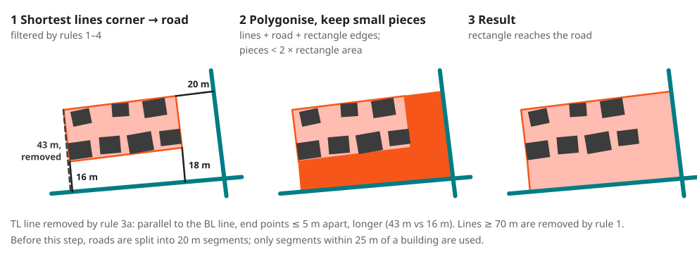
</p>

*Figure: EdgeCatch — corner lines connect the rectangle to the road; the enclosed pieces extend the settlement polygon up to the road.*

---

### Step 8 — ErodeEmptyAreas: Building-Free Void Removal

`ErodeEmptyAreas.py` removes building-free protrusions at the settlement fringe — lobes of the settlement polygon without buildings that hang off the built area by a narrow connection (e.g. a field enclosed by the rectangle of an edge building). Without this step, such protrusions inflate the settlement footprint and cause GapClose (Step 9) to bridge gaps across open space that should remain open. Building-free areas enclosed by built settlement (parks, courtyards) are kept.

```
INPUT: settlement polygon (output of EdgeCatch merge), building footprints

1. Select buildings within the settlement boundary (intersects predicate)
   → If no buildings found: return settlement unchanged

2. Buffer each building by clamp(sqrt(area), 10 m, 100 m)
   → Small buildings (≤ 100 m²): 10 m buffer
   → Large buildings (≥ 10 000 m²): 100 m buffer

3. Dissolve all building buffers into a single union polygon
   (via QgsGeometry.unaryUnion() — avoids collect/sink-type mismatch)

4. Compute building-free voids:
   difference(settlement, buffer_union) → empty areas
   Keep only areas ≥ 500 m²

5. Protrusion filter:
   a. Temporarily subtract all voids from the settlement; split the
      remainder into parts. Parts containing a building = built settlement.
   b. Split each void's perimeter into
        building contact — borders a built part
        void contact     — borders another void
        free edge        — everything else (open land at the outer
                           boundary, or remainder parts without buildings)
   c. Remove the void if building contact < 20 % AND free edge ≥ 80 %
      (both thresholds are parameters and depend on the local situation)
   → Interior voids (100 % building contact) are kept.
   → Voids between built parts and fringe bays are kept.

6. Subtract the selected voids from the original settlement
OUTPUT: settlement polygon with building-free protrusions removed
```

<p align="center">
  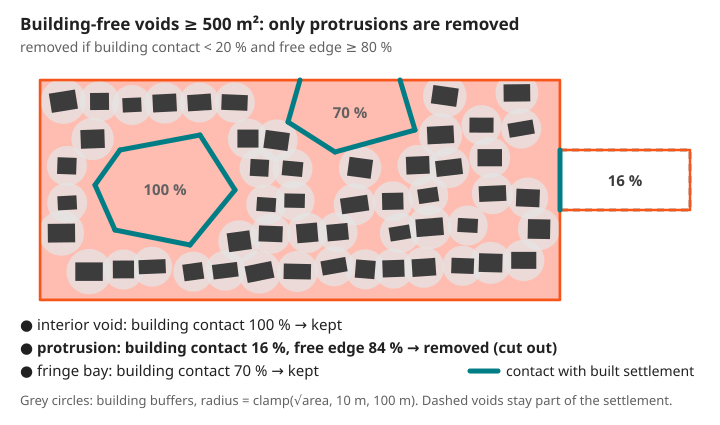
</p>

*Figure: ErodeEmptyAreas protrusion filter — only voids with building contact < 20 % and free edge ≥ 80 % are removed.*

The buffer distance scales with `sqrt(building_area)`, giving each building a protection zone proportional to its geometric radius. In dense clusters the buffer zones merge, naturally covering the built-up area; isolated buildings still protect a 10–100 m surroundings.

---

### Step 9 — GapClose: Holes and Gap Closing

`GapClose.py` corrects two classes of topological defects in the settlement polygon:

<p align="center">
  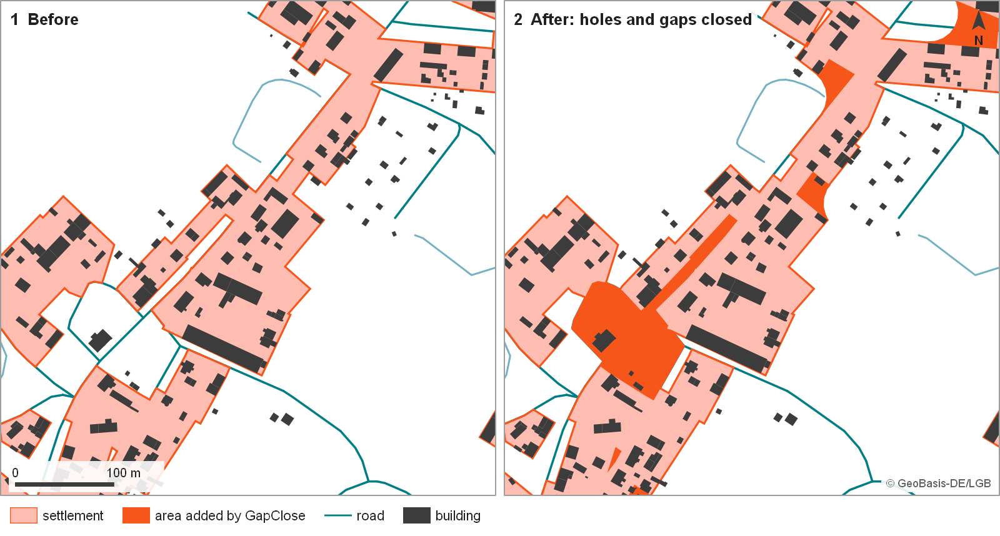
</p>

*Figure: GapClose — the settlement before and after; orange marks all area added by hole and gap closing. Data: © GeoBasis-DE/LGB.*

#### Sub-step 9a — Close holes inside settlement polygons

Undeveloped areas completely enclosed by the settlement (parks, courtyards, gardens) that are larger than a threshold are *removed* from the settlement area:

```
IF area(hole) > max_hole_size (default: 1 ha = 10,000 m²):
    subtract hole from settlement polygon
```

Smaller holes are closed using morphological closing:

```
gap_close_in_holes():
1. Positive buffer (+15 m)  →  closes small gaps
2. Negative buffer (−15 m)  →  restores original extent
3. Remove remaining holes smaller than max_hole_size
```

#### Sub-step 9b — Close gaps between adjacent settlement polygons

Narrow gaps between neighbouring polygons (e.g. a road that was cut out, or a missed building row) are bridged using a double-buffer approach:

```
INPUT: dissolved settlement polygons

1. Buffer settlement by +15 m, dissolved          →  layer A
   (clusters less than 30 m apart merge)
2. Buffer the outer boundary line of A by 15.3 m   →  edge zone
3. A minus edge zone                               →  settlement with bridged gaps
4. Minus the original settlement polygons          →  gap polygons

5. Delete gap polygons < 200 m²
   (artefacts from corners/buffering)

6. FOR each remaining gap polygon:
   Filter 1 (area < max_gap_size, ≥ 70% border overlap):
       ADD gap to settlement  (parcel surrounded on ≥ 3 sides)
   Filter 2 (≥ 90% border overlap, any size):
       ADD gap to settlement  (almost fully enclosed)
   Filter 3 / compact large gaps (area ≥ max_gap_size, 70–90% border overlap):
       densify outline (10 m), tessellate into triangles;
       ADD every triangle whose longest side is < 70 m
```

The 70 m threshold for the compact-gap filter is based on German planning guidance (Bukies et al. 2009): an undeveloped strip of 50–60 m is generally considered inside the Innenbereich; even 90 m does not necessarily interrupt the built-up area.

<p align="center">
  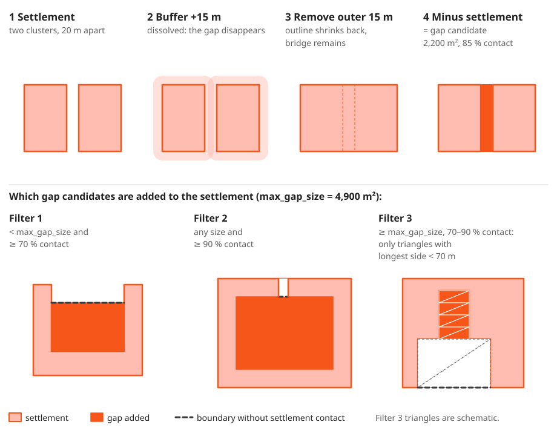
</p>

*Figure: GapClose — gap candidates from the double buffer (top) and the three filters that decide which gaps are added (bottom).*

---

### Step 10 — PatchRemove: Splinter Area Removal

`PatchRemove.py` removes result polygons that are too small or contain too few buildings to represent a meaningful settlement unit.

According to planning guidance (Bukies et al. 2009; Long et al. 2015), typically 20–25 residential buildings are needed for an independent Innenbereich, and areas below 1 ha should not be treated as separate settlements:

```
INPUT: settlement polygons, all buildings (sel_hu_layer)

FOR each result polygon:
    n_buildings = count(buildings intersecting polygon)
    IF area(polygon) < min_patch_size  AND  n_buildings < min_bdg_count:
        remove polygon
```

Default thresholds: `min_patch_size = 10,000 m²` (1 ha), `min_bdg_count = 20`.

After patch removal, the gap-closing step is applied once more across the entire partition result to close any narrow gaps that opened between the remaining polygons.

---

### Merge and Output

After all partitions are processed, the per-partition results are merged into a single layer. The final layer is saved as a GeoPackage at the configured output path.

---

For the full parameter reference including defaults, sensitivity notes, and academic background, see [docs/parameterization.md](parameterization.md).

---

## Accuracy (Harig et al. 2021)

The method was validated against expert delineations (EDs) in three German study areas:

| Study area | Settlement type | Accuracy |
|------------|----------------|----------|
| Frankfurt/Main | Compact urban | 93.9% |
| Hanover region | Mixed suburban | 81.6% |
| Brandenburg | Dispersed rural | 74.6% |

The method performs best for compact settlements. Dispersed rural settlements with low building density and large inter-building distances are the most challenging case, as the boundary between included and excluded fringe development cannot always be determined objectively.

---

## Output

The result is a **GeoPackage** (`.gpkg`) containing one polygon layer with the delineated Innenbereich boundaries. Each polygon represents one settlement body.

The workspace folder additionally contains:
- Intermediate GeoPackages per partition (for inspection)
- A partition log file (`IB_Tool2_Log.txt`) — tracks completed partitions, allows resuming interrupted runs
- Debug layers in `debug/` subdirectories (when **Debug Mode** is enabled in the dialog)

---

## Related Files

| File | Content |
|------|---------|
| [`docs/input-data.md`](input-data.md) | Input layer specifications, field requirements, filter file format |
| [`docs/parameterization.md`](parameterization.md) | Full parameter reference with defaults and sensitivity notes |
| [`docs/error-handling.md`](error-handling.md) | Logging system, debug mode, error categories |
| [`docs/plugin-architecture.md`](plugin-architecture.md) | Code structure, entry points, package layout |
